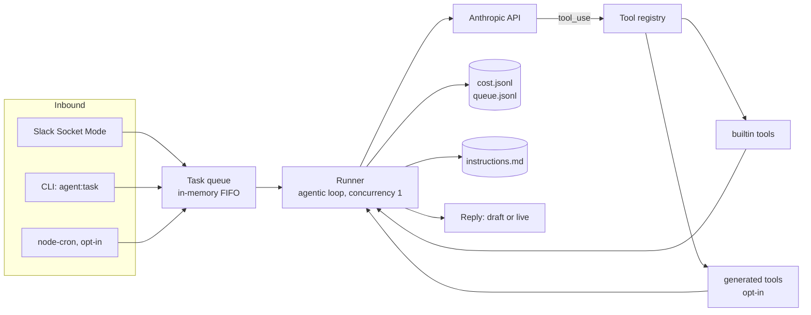

# Oski: The Self-Evolving AI Ops Agent

Oski is a self-evolving AI operations runtime for small teams.

It turns team requests into controlled agent runs across Slack, CLI, scheduled jobs, local workspace context, and a typed tool registry. It can read approved files, search code, draft updates, track cost, learn team-specific instructions, and propose new tools when it hits a capability gap.

Slack is the command surface. The core product is the operating layer: queue, runner, typed tools, instruction memory, cost controls, draft-first side effects, audit logs, and reviewed capability expansion.

Oski is built as a reference architecture for teams that want internal agents they can inspect, constrain, and extend.

## Why this matters

Small teams need more than chat over documents. They need agents that can work across context, use tools safely, learn operating preferences, and expand their capabilities without removing human control.

Most internal agent projects fail in one of two ways. They stay static, limited to a fixed integration list. Or they become too open-ended, giving the model broad code execution without enough review or auditability.

Oski is built for the middle path: an agent that can grow, but only through files, logs, scopes, and human review.

## The self-evolution loop

1. A task arrives from Slack, CLI, or cron.
2. Oski checks its typed tool registry.
3. If a tool exists, it uses it.
4. If no tool exists and codegen is enabled, Oski can scaffold a new TypeScript tool.
5. The new tool lands as a real file in `src/tools/generated/`.
6. It is logged, reviewable, and not trusted for live action until a human approves it.

The agent can propose new capability. It cannot grant itself trust.

## What makes it different

- **Operations runtime, not a chatbot wrapper.** Tasks move through a queue, runner, typed tool registry, logs, and explicit policy controls.
- **Durable behavioral memory.** `instructions.md` is a plain-text operating manual, versioned in git and loaded fresh every turn.
- **Draft-first execution.** Outbound actions default to drafts. Going live is an explicit per-tool decision.
- **Hard cost controls.** A daily USD cap halts the queue. Unknown models price at the most expensive tier by default.
- **Reviewable capability growth.** New tools can be scaffolded, but they start untrusted and land as normal files.
- **Readable safety model.** Every claim maps to code, docs, or configuration. Nothing runs unsupervised by default.

## Architecture



- **Queue.** In-memory FIFO with an append-only JSONL mirror at `data/agent/queue.jsonl`. Concurrency is 1. One task at a time keeps cost and behavior predictable.
- **Runner.** Each task is an agentic loop. The model can call tools for up to 10 steps before producing a final reply. A cheap model handles routing. The runner escalates to a stronger model once a task proves it needs multiple tool calls. Retries with backoff on rate limits. Hard 120s timeout per task.
- **Tools.** Every tool is a TypeScript file exporting a typed `ToolDefinition` with a `read`, `draft`, or `live` scope. The registry discovers builtin tools at startup and hot-reloads `src/tools/generated/`.
- **Cost log.** Every turn writes model, tokens, and estimated USD to `data/agent/cost.jsonl`. The queue checks the daily cap before starting each task.
- **Instructions.** `instructions.md` loads fresh into the system prompt on every turn. The team extends it with `oski learn:` in Slack. No redeploy required.

Full internals, including exactly where enforcement lives, are in [docs/ARCHITECTURE.md](docs/ARCHITECTURE.md).

## The three memory layers

| Layer | What it is | How it is updated |
|---|---|---|
| **Factual memory** | Approved workspace files, scoped to `OSKI_WORKSPACE_ROOTS` | Read live, per task. Never cached or embedded |
| **Behavioral memory** | `instructions.md`, loaded fresh into the system prompt every turn | `oski learn:` through `update_instructions`, rate-capped, or edited directly in git |
| **Procedural memory** | The typed tool registry: builtins, custom tools, and optional generated tools | Adding a builtin is a PR. Generated tools require `OSKI_ENABLE_CODEGEN=true` plus human review |

None of these are vector stores or embeddings today. Factual memory is direct file reads. Behavioral memory is a plain-text file. Procedural memory is a directory of TypeScript files. That is a deliberate simplicity choice for a small-team-scale agent.

## Safety model

1. **Draft-first.** Outbound actions return draft text by default. Going live requires adding the tool name to `OSKI_LIVE_TOOLS`, a deliberate per-tool decision.
2. **Deny-by-default file access.** `read_file` and `search_code` only touch directories in `OSKI_WORKSPACE_ROOTS`. No roots configured means no access. Symlinks are resolved and re-checked so they cannot escape the sandbox.
3. **No shell interpolation.** `search_code` and `generate_tool` invoke external processes via `execFile` with argument arrays. Model-supplied input never touches a shell string.
4. **Hard budget.** The queue checks the daily USD cap before starting each task. Unknown models price at the most expensive tier by default.
5. **Codegen is opt-in, experimental, and unsandboxed.** `generate_tool` refuses to run unless `OSKI_ENABLE_CODEGEN=true`. Generated tools load at `read` scope by convention, but they run as real code with full process permissions. There is no container around this today. Read a generated tool before keeping it. Never add one to `OSKI_LIVE_TOOLS` without review.
6. **Audit trails.** Task queue, cost, and instruction edits each get an append-only JSONL log under `data/agent/`.

Threat model detail, including how each `live`-scoped tool enforces its own trust boundary, is in [SECURITY.md](SECURITY.md) and [docs/ARCHITECTURE.md](docs/ARCHITECTURE.md).

## Example workflows

```
You (in Slack):  oski: summarize the open items in TODO.md
Oski:            Got it. Working on it... (task 3f2a91bc)
Oski (in thread): 3 open items: ship the billing fix (owner: A), write the
                  onboarding doc (owner: B, overdue), schedule the retro.

You:             oski: draft an internal update about this week's progress
Oski (in thread): DRAFT (not posted): "This week: billing fix shipped, onboarding
                  doc in review, retro scheduled Fri..." Reply 'send it' to post live.

You:             oski learn: always mention owners by name in summaries
Oski:            Got it. Learning: "always mention owners by name in summaries"

You:             oski cost
Oski:            Today: $0.0312 / $2 cap. This week: $0.1877.
```

More walkthroughs, including building a custom read-only tool, are in [docs/EXAMPLES.md](docs/EXAMPLES.md).

## What this repo is and is not

**It is:**

- A reference architecture for a controllable internal AI operations agent.
- Able to answer questions about approved team files and notes.
- Able to draft internal updates and replies for human review.
- Able to learn behavioral rules from plain-English feedback.
- Able to propose new tool files when codegen is explicitly enabled.
- Bounded by a hard daily budget by construction.

**It is not:**

- Fully autonomous. Every side-effectful action starts as a draft and stays a draft until a human explicitly trusts the tool.
- A production back office. There is no durable job queue, no horizontal scaling, no sandboxed code execution, and no test suite yet. See [docs/ARCHITECTURE.md](docs/ARCHITECTURE.md#what-a-production-deployment-would-need-next) for the gap list.
- Connected to any CRM, billing system, or support desk by default. There is no Stripe, HubSpot, or Intercom integration in this repo.
- Capable of sending email on its own. The one email example in `examples/plugins/` only creates Gmail drafts. Sending is always a manual step in Gmail.
- Multi-tenant. One agent, one team, one channel.

## Quickstart

Requirements: Node 20+, an Anthropic API key, and [ripgrep](https://github.com/BurntSushi/ripgrep#installation) (`rg`) for the `search_code` tool.

```bash
git clone <your-fork-url> oski-agent
cd oski-agent
npm install
cp .env.example .env
# edit .env: add ANTHROPIC_API_KEY, set OSKI_WORKSPACE_ROOTS
```

Run a task from the CLI, no Slack needed:

```bash
npm run agent:task -- "list your loaded tools"
```

Start the agent, Slack if configured, otherwise CLI-only:

```bash
npm run dev
```

Build and run compiled:

```bash
npm run build
npm start
```

## Slack setup

Full walkthrough in [docs/SLACK_SETUP.md](docs/SLACK_SETUP.md). Short version: create a Slack app, enable Socket Mode, add bot scopes, install to your workspace, invite the bot to one channel, and set three env vars (`OSKI_SLACK_APP_TOKEN`, `OSKI_SLACK_BOT_TOKEN`, `OSKI_SLACK_CHANNEL_ID`). Socket Mode means no public URL and no webhook configuration.

## Environment variables

| Variable | Required | Purpose |
|---|---|---|
| `ANTHROPIC_API_KEY` | yes | Anthropic API access |
| `ANTHROPIC_MODEL_DEFAULT` | no | Cheap model for routing/triage (default `claude-haiku-4-5`) |
| `ANTHROPIC_MODEL_REASONING` | no | Stronger model for multi-step tasks (default `claude-sonnet-4-5`) |
| `OSKI_WORKSPACE_ROOTS` | for file tools | Comma-separated dirs the agent may read/search. Empty means no access. |
| `OSKI_DAILY_USD_CAP` | no | Daily spend cap in USD (default `2`) |
| `OSKI_LIVE_TOOLS` | no | Comma-separated tools allowed live writes. Empty means all draft. |
| `OSKI_SLACK_APP_TOKEN` | for Slack | App-level token for Socket Mode |
| `OSKI_SLACK_BOT_TOKEN` | for Slack | Bot user OAuth token |
| `OSKI_SLACK_CHANNEL_ID` | for Slack | Channel where Oski listens |
| `OSKI_SLACK_SIGNING_SECRET` | no | Only for the HTTP Events API fallback |
| `OSKI_ENABLE_CODEGEN` | no | EXPERIMENTAL self-authored tools (default `false`) |
| `CLAUDE_CLI_PATH` | no | Path to the Claude Code CLI (codegen only) |
| `OSKI_CRON_ENABLED` | no | Enable the example recurring jobs (default `false`) |
| `OSKI_HEARTBEAT_ENABLED` | no | Daily "I'm online" Slack post (default `false`) |
| `OSKI_TIMEZONE` | no | IANA timezone for the system prompt clock (default `UTC`) |

## Tool development

A tool is one file:

```ts
import type { ToolDefinition } from '../../tool-registry';

const tool: ToolDefinition = {
  name: 'check_weather',            // snake_case, unique
  description: 'Get the current weather for a city.',
  scope: 'read',                    // read | draft | live
  inputSchema: {
    type: 'object',
    properties: {
      city: { type: 'string', description: 'City name.' },
    },
    required: ['city'],
  },
  async run({ city }) {
    // Return errors as values, never throw.
    return { city, forecast: 'sunny' };
  },
};

export default tool;
```

Drop it in `src/tools/builtin/`, restart, done. Scope is a declared convention. Enforcement happens inside each tool's own `run()`:

- `read`: no side effects, always runs.
- `draft`: produces the artifact (message text, email body) but does not send unless the tool checks `OSKI_LIVE_TOOLS` and finds itself listed.
- `live`: side-effectful, or capable of modifying agent state. Each `live` tool implements its own gate. `slack_post_draft` and `generate_tool` check an allowlist or flag before doing anything real. `update_instructions` uses a daily edit cap instead, since editing local instructions carries less risk than an external send or arbitrary codegen.

1. Copy an existing file in `src/tools/builtin/` as a template.
2. Keep the scope at `read` unless it genuinely needs to write.
3. Catch every error and return `{ error: string }`. Never throw.
4. Restart the agent and run `oski tools` (Slack) or `npm run agent:task -- "list your loaded tools"` to confirm it loaded.

Riskier integrations (email, databases) live in [examples/plugins/](examples/plugins/) with placeholder-only setup instructions. They are not loaded by default.

## Roadmap

Current gaps:

- Durable, replayable task queue. Today the queue is in-memory. A crash mid-task loses the in-flight task, though the JSONL log survives.
- A test suite and CI. `npm run build` passing is the current gate.
- Sandboxed execution for generated tools. Today `generate_tool` runs the Claude Code CLI directly on the host process.
- Structured metrics and alerting beyond console logs and JSONL files.
- Secrets manager support as an alternative to plain `.env` files.

## License

MIT. See [LICENSE](LICENSE).
