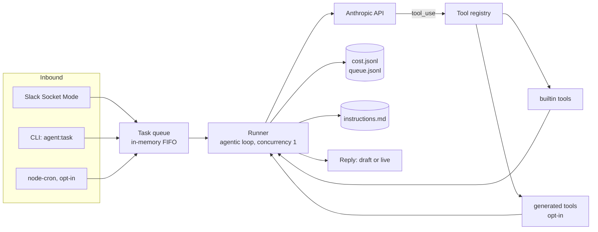

# Oski: a self-extending internal ops agent for small teams

Oski is an open-source TypeScript runtime for building Slack-native internal AI agents. It combines a lightweight task queue, Anthropic tool calling, a typed tool registry, durable behavioral instructions, cost controls, and a draft-first safety model.

**The key idea:** most AI assistants are stateless chat windows. Oski is closer to an internal operator — it lives in Slack, reads approved context, calls explicit tools, drafts actions for review, learns team-specific rules, and can optionally scaffold new tools when it hits a capability gap.

It is not a magic autonomous employee. It is a practical reference architecture for building internal agents with real operational constraints: explicit tool boundaries, draft-first execution, and a hard cost ceiling.

## Why Oski exists

Most "AI agent" demos are a chat window with a big system prompt. That's fine for a toy, but it breaks down the moment you want an agent embedded in how a team actually works — where every action needs an audit trail, every dollar spent needs a ceiling, and every side effect needs a human in the loop before it leaves the building.

Oski starts from those constraints instead of bolting them on afterward. The queue, the tool registry, the cost log, and the draft-first default all exist because an internal agent that can read your files and post in your team's Slack needs boundaries that are enforced in code, not just described in a prompt.

## What makes it different

- **Explicit tool boundary.** The model can only do what's in the typed tool registry — no shell access, no arbitrary code execution from the main loop. Every tool is a single reviewable TypeScript file.
- **Draft-first execution.** Side-effectful tools return draft text by default. Going live is a deliberate, per-tool opt-in (`OSKI_LIVE_TOOLS`), not the default state.
- **Durable behavioral memory.** `instructions.md` is loaded fresh on every turn and can be extended in plain English (`oski learn: ...`) without a redeploy — the agent's behavior evolves as a readable, git-trackable file, not a black-box fine-tune.
- **Hard cost ceiling.** A daily USD cap halts the task queue outright. Unknown models are priced at the most expensive known tier so the cap always errs toward pausing early.
- **Self-extension, not self-modification.** When the agent hits a capability gap, it can (optionally) scaffold a new tool — but the generated file loads at read scope and requires human review before it is trusted with anything live. See [docs/SELF_EXTENSION.md](docs/SELF_EXTENSION.md).

## Architecture



- **Queue.** In-memory FIFO with an append-only JSONL mirror at `data/agent/queue.jsonl`. Concurrency is 1 — one task at a time keeps cost and behavior predictable.
- **Runner.** Each task is an agentic loop: the model can call tools for up to 10 steps before producing a final reply. A cheap model (`claude-haiku-4-5` by default) handles routing; the runner automatically escalates to a stronger model (`claude-sonnet-4-5` by default) once a task proves to need multiple tool calls. Retries with backoff on rate limits, hard 120s timeout per task.
- **Tools.** Every tool is a TypeScript file exporting a typed `ToolDefinition` with a `read` / `draft` / `live` scope. The registry discovers builtin tools at startup and hot-reloads `src/tools/generated/` via a filesystem watcher.
- **Cost log.** Every turn writes model, tokens, and estimated USD to `data/agent/cost.jsonl`. The queue checks the daily cap before starting each task and pauses when it's hit.
- **Instructions.** `instructions.md` is read fresh on every turn and folded into the system prompt. Anyone on the team can extend it via `oski learn:` in Slack. No redeploy required.

Full internals — including where enforcement actually lives, and what a production deployment would still need — are in [docs/ARCHITECTURE.md](docs/ARCHITECTURE.md).

## The three memory layers

Oski separates what the agent knows into three distinct layers, each with a different update mechanism and a different risk profile:

| Layer | What it is | How it's updated |
|---|---|---|
| **Factual memory** | Approved workspace files and whatever the `read_file` / `search_code` tools can see, scoped to `OSKI_WORKSPACE_ROOTS` | Read live, per task — never cached or embedded |
| **Behavioral memory** | `instructions.md`, loaded fresh into the system prompt every turn | Edited via `oski learn:` (through `update_instructions`, rate-capped) or directly in git |
| **Procedural memory** | The typed tool registry: builtins, hand-written custom tools, and optional generated tools | Adding a builtin is a PR; generated tools require `OSKI_ENABLE_CODEGEN=true` plus human review |

None of these are vector stores or embeddings today — factual memory is direct file reads, behavioral memory is a plain-text file, and procedural memory is a directory of TypeScript files. That's a deliberate simplicity choice for a small-team-scale agent, not a placeholder for something more exotic.

## The self-extension loop

1. A task arrives (Slack, CLI, or cron).
2. The runner checks the tool registry for something that fits.
3. If a tool exists, it's called directly — normal agentic tool use.
4. If no tool fits and codegen is enabled (`OSKI_ENABLE_CODEGEN=true`, off by default), the agent can call `generate_tool` to scaffold a new one via the Claude Code CLI, capped at 3 generations/day.
5. The new file lands in `src/tools/generated/` at `read` scope and is hot-reloaded — but it is **not** trusted for live or side-effectful action until a human reviews it and, if appropriate, promotes it into `src/tools/builtin/` or adds it to `OSKI_LIVE_TOOLS`.

This is a capability-growth pattern, not autonomous self-modification: nothing generated code writes ever runs unreviewed in a live/side-effectful capacity. See [docs/SELF_EXTENSION.md](docs/SELF_EXTENSION.md) for the full reasoning, including how this differs from naive function calling.

## Safety model

1. **Draft-first.** Outbound actions return draft text for human review by default. Going live requires adding the tool name to `OSKI_LIVE_TOOLS` — a deliberate, per-tool decision.
2. **Deny-by-default file access.** `read_file` and `search_code` only touch directories in `OSKI_WORKSPACE_ROOTS`. No roots configured means no access. Symlinks are resolved and re-checked so they cannot escape the sandbox.
3. **No shell interpolation.** `search_code` and `generate_tool` invoke external processes via `execFile` with argument arrays. Model-supplied input is never concatenated into a shell string.
4. **Hard budget.** The queue checks the daily USD cap before starting each task and pauses once it's reached. Unknown models are priced at the most expensive tier so the cap errs toward pausing early.
5. **Codegen is opt-in, experimental, and unsandboxed.** `generate_tool` refuses to run unless `OSKI_ENABLE_CODEGEN=true`. Generated tools load at `read` scope by convention, but they are real code executing directly on the host with full process permissions — there is no container or sandbox around this today. **Always read a generated tool before keeping it, and never add one to `OSKI_LIVE_TOOLS` without review.**
6. **Audit trails.** Task queue, cost, and instruction edits each get an append-only JSONL log under `data/agent/`.

Threat model detail — including how each `live`-scoped tool enforces its own trust boundary — is in [SECURITY.md](SECURITY.md) and [docs/ARCHITECTURE.md](docs/ARCHITECTURE.md).

## Example workflows

```
You (in Slack):  oski: summarize the open items in TODO.md
Oski:            Got it. Working on it... (task 3f2a91bc)
Oski (in thread): 3 open items: ship the billing fix (owner: A), write the
                  onboarding doc (owner: B, overdue), schedule the retro.

You:             oski: draft an internal update about this week's progress
Oski (in thread): DRAFT (not posted): "This week: billing fix shipped, onboarding
                  doc in review, retro scheduled Fri..." Reply 'send it' to post live.

You:             oski learn: always mention owners by name in summaries
Oski:            Got it. Learning: "always mention owners by name in summaries"

You:             oski cost
Oski:            Today: $0.0312 / $2 cap. This week: $0.1877.
```

More walkthroughs — including building a custom read-only tool — are in [docs/EXAMPLES.md](docs/EXAMPLES.md).

## What this repo is and is not

**It is:**
- A reference architecture for a Slack-native internal ops agent runtime, built for founders, operators, and small teams who want an agent they can inspect and control.
- Answers questions about a team's own files and notes without copy-pasting into a chat window.
- Drafts internal updates and replies for human review.
- Learns behavioral rules from plain-English feedback.
- Stays inside a hard daily budget by construction.

**It is not:**
- Fully autonomous. Every side-effectful action starts as a draft and stays a draft until a human explicitly trusts the tool.
- A production back office. There is no durable/replayable job queue, no horizontal scaling, no sandboxed code execution, and no test suite yet — see [docs/ARCHITECTURE.md](docs/ARCHITECTURE.md#what-a-production-deployment-would-need-next) for the honest gap list.
- Connected to any CRM, billing system, or support desk. There is no Stripe, HubSpot, or Intercom integration in this repo.
- Capable of sending email autonomously. The one email example in `examples/plugins/` only creates Gmail drafts — sending is always a manual step in Gmail.
- Multi-tenant. One agent, one team, one channel. That's the point.

## Quickstart

Requirements: Node 20+, an Anthropic API key, and [ripgrep](https://github.com/BurntSushi/ripgrep#installation) (`rg`) for the `search_code` tool.

```bash
git clone <your-fork-url> oski-agent
cd oski-agent
npm install
cp .env.example .env
# edit .env: add ANTHROPIC_API_KEY, set OSKI_WORKSPACE_ROOTS
```

Run a task from the CLI (no Slack needed):

```bash
npm run agent:task -- "list your loaded tools"
```

Start the agent (Slack if configured, otherwise CLI-only mode):

```bash
npm run dev
```

Build and run compiled:

```bash
npm run build
npm start
```

## Slack setup

Full walkthrough in [docs/SLACK_SETUP.md](docs/SLACK_SETUP.md). Short version: create a Slack app, enable Socket Mode, add bot scopes, install to your workspace, invite the bot to one channel, and set three env vars (`OSKI_SLACK_APP_TOKEN`, `OSKI_SLACK_BOT_TOKEN`, `OSKI_SLACK_CHANNEL_ID`). Socket Mode means no public URL and no webhook configuration.

## Environment variables

| Variable | Required | Purpose |
|---|---|---|
| `ANTHROPIC_API_KEY` | yes | Anthropic API access |
| `ANTHROPIC_MODEL_DEFAULT` | no | Cheap model for routing/triage (default `claude-haiku-4-5`) |
| `ANTHROPIC_MODEL_REASONING` | no | Stronger model for multi-step tasks (default `claude-sonnet-4-5`) |
| `OSKI_WORKSPACE_ROOTS` | for file tools | Comma-separated dirs the agent may read/search. **Empty = no access.** |
| `OSKI_DAILY_USD_CAP` | no | Daily spend cap in USD (default `2`) |
| `OSKI_LIVE_TOOLS` | no | Comma-separated tools allowed live writes. **Empty = all draft.** |
| `OSKI_SLACK_APP_TOKEN` | for Slack | App-level token for Socket Mode |
| `OSKI_SLACK_BOT_TOKEN` | for Slack | Bot user OAuth token |
| `OSKI_SLACK_CHANNEL_ID` | for Slack | Channel where Oski listens |
| `OSKI_SLACK_SIGNING_SECRET` | no | Only for the HTTP Events API fallback |
| `OSKI_ENABLE_CODEGEN` | no | EXPERIMENTAL self-authored tools (default `false`) |
| `CLAUDE_CLI_PATH` | no | Path to the Claude Code CLI (codegen only) |
| `OSKI_CRON_ENABLED` | no | Enable the example recurring jobs (default `false`) |
| `OSKI_HEARTBEAT_ENABLED` | no | Daily "I'm online" Slack post (default `false`) |
| `OSKI_TIMEZONE` | no | IANA timezone for the system prompt clock (default `UTC`) |

## Tool development

A tool is one file:

```ts
import type { ToolDefinition } from '../../tool-registry';

const tool: ToolDefinition = {
  name: 'check_weather',            // snake_case, unique
  description: 'Get the current weather for a city.',
  scope: 'read',                    // read | draft | live
  inputSchema: {
    type: 'object',
    properties: {
      city: { type: 'string', description: 'City name.' },
    },
    required: ['city'],
  },
  async run({ city }) {
    // Return errors as values, never throw.
    return { city, forecast: 'sunny' };
  },
};

export default tool;
```

Drop it in `src/tools/builtin/`, restart, done. Scope is a declared convention — enforcement happens inside each tool's own `run()`:

- `read` — no side effects, always runs.
- `draft` — produces the artifact (message text, email body) but does not send unless the tool checks `OSKI_LIVE_TOOLS` and finds itself listed.
- `live` — side-effectful, or capable of modifying agent state. Each `live` tool implements its own gate: `slack_post_draft` and `generate_tool` check an allowlist/flag before doing anything real; `update_instructions` uses a daily edit cap instead, since editing local instructions carries less risk than an external send or arbitrary codegen.

1. Copy an existing file in `src/tools/builtin/` as a template.
2. Keep the scope at `read` unless it genuinely needs to write.
3. Catch every error and return `{ error: string }` — never throw.
4. Restart the agent and run `oski tools` (Slack) or `npm run agent:task -- "list your loaded tools"` to confirm it loaded.

Riskier integrations (email, databases) live in [examples/plugins/](examples/plugins/) with placeholder-only setup instructions. They are not loaded by default.

## Roadmap

Honest, not aspirational — these are gaps, not promises:

- Durable, replayable task queue (currently in-memory; a crash mid-task loses the in-flight task, though the JSONL log survives).
- A test suite and CI (`npm run build` passing is the only current gate).
- Sandboxed execution for generated tools (today `generate_tool` runs the Claude Code CLI directly on the host process).
- Structured metrics/alerting beyond console logs and JSONL files.
- Secrets manager support as an alternative to plain `.env` files.

## Why this matters for small teams

Small teams can't afford an agent they have to take on faith. They need one they can read end to end in an afternoon, run on their own infrastructure, and extend without waiting on a vendor roadmap. Oski is built for that: every tool is a file you can open, every action defaults to a draft you can veto, and every dollar spent is capped and logged. That's a smaller promise than "autonomous AI employee" — and it's one this repo actually keeps.

## License

MIT — see [LICENSE](LICENSE).
