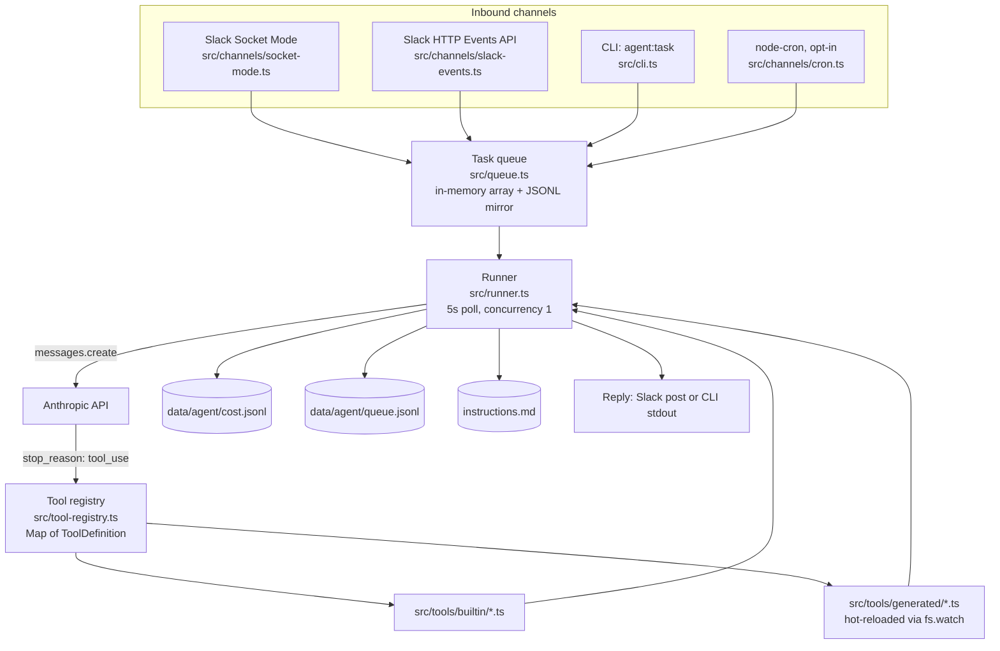

# Architecture

This document describes what is actually implemented in this repository today, and calls out clearly where something is a future direction rather than current behavior.

## System overview

Everything is a single Node.js process. There is no separate worker fleet, message broker, or database — this is a deliberate scope decision for a small-team-sized agent, not an oversight. See [What a production deployment would need next](#what-a-production-deployment-would-need-next) for what changes if that scope grows.

## Queue and runner

**Queue (`src/queue.ts`).** An in-memory array (`AgentTask[]`) with an append-only JSONL mirror at `data/agent/queue.jsonl` for audit purposes. `enqueue()` pushes, `dequeue()` shifts (FIFO). The JSONL log is a write-only audit trail, not a source of truth for replay — if the process restarts, in-memory queue state is lost, and only the log record of what was enqueued survives.

**Runner (`src/runner.ts`).** A `setInterval` polls every 5 seconds; if the queue is non-empty it calls `processNextTask()`, which dequeues exactly one task. Concurrency is fixed at 1 — there is no parallel task execution. Each task runs `runAgenticLoop()`:

- Before starting, the runner checks `todaySpendUsd() >= POLICY.dailyCapUsd` and refuses to run if the cap is already hit.
- If the task originated from a Slack thread, the runner fetches up to 20 prior messages via `conversations.replies` for context continuity.
- The model call loop runs for up to 10 steps. Each step is a `client.messages.create()` call with the full tool list attached.
- `withRetry()` retries on rate-limit/overload/connection errors (up to 3 attempts, 30s wait on rate limits, exponential backoff otherwise). `withTimeout()` enforces a hard 120-second ceiling on the entire task via `Promise.race`.
- **Model escalation.** Every task starts on `POLICY.defaultModel` (a cheap/fast model). Once the loop reaches step 2 with at least one tool call made, the runner switches to `POLICY.reasoningModel` for the remaining steps. This is a simple step-count heuristic, not a classifier — it exists to keep single-tool-call tasks cheap while giving multi-step tasks a stronger model.
- Every tool call and its result are logged via `log.toolCall()`. When the loop ends, `logCost()` writes one JSONL line with model, token counts, estimated USD, and the list of tool names called.

## Tool registry

`src/tool-registry.ts` is intentionally thin: a `Map<string, ToolDefinition>` populated at startup by reading every `.ts`/`.js` file in `src/tools/builtin/` and `src/tools/generated/`, `require()`-ing each one, and registering the default export if it has a `name` and a `run` function. `src/tools/generated/` is additionally watched with `fs.watch()` so newly generated tool files are picked up without a restart.

`toAnthropicTools()` serializes the registry into the `{ name, description, input_schema }` shape the Anthropic Messages API expects for the `tools` parameter — this is the only place the tool list is translated for the model.

## Tool scopes

Each `ToolDefinition` declares a scope: `read`, `draft`, or `live`. This is important to state precisely: **scope is a declared convention, not a runtime gate enforced by the registry or the runner.** The runner calls `tool.run(input)` directly regardless of declared scope. Enforcement is delegated to each tool's own implementation:

| Tool | Scope | How it actually enforces the boundary |
|---|---|---|
| `read_file`, `search_code` | `read` | Refuse to touch anything outside `OSKI_WORKSPACE_ROOTS`; symlinks are resolved and re-checked so they can't escape the sandbox |
| `slack_post_draft` | `draft` | Checks `isToolLive('slack_post_draft')` against the `OSKI_LIVE_TOOLS` allowlist; returns draft text instead of posting if not listed |
| `generate_tool` | `live` | Checks `isCodegenEnabled()` (`OSKI_ENABLE_CODEGEN=true`); also capped at 3 generations/day |
| `update_instructions` | `live` | Not gated by `OSKI_LIVE_TOOLS` — instead rate-limited to 5 edits/day and 500 characters/edit, since appending to a local instructions file is treated as lower-risk than an external send or arbitrary code generation |

This "thin core, tools self-enforce" design keeps the registry and runner simple, but it means adding a new `live`-scoped tool requires the tool author to actually implement a real gate — the framework will not do it for them. This is called out explicitly in [CONTRIBUTING.md](../CONTRIBUTING.md).

## Cost control

`src/cost-log.ts` maintains a small hardcoded pricing table (`PRICING`), keyed by model name prefix, for input/output cost per million tokens. Unknown models fall back to the most expensive known tier (currently the Opus row) so that a misconfigured or newly released model name errs toward pausing the queue early rather than silently overspending.

`todaySpendUsd()` and `weekSpendUsd()` read and sum `data/agent/cost.jsonl` on demand — there is no in-memory running total, so the log file is the actual source of truth for spend. The runner checks the daily cap **before** starting a task; it does not interrupt a task that is already in progress if the cap is crossed mid-task.

## Instruction memory

`instructions.md` lives at the project root and is read fresh (`fs.readFileSync`) on every single turn inside `buildSystemPrompt()` — there is no caching, so an edit takes effect on the very next task. The `update_instructions` tool appends a bullet under a named `##` section (creating the section if it doesn't exist), and logs every edit to `data/agent/instruction-edits.jsonl`. Rules are append-only by convention (enforced in the system prompt text and in `CONTRIBUTING.md`, not in code) — the tool has no mechanism to remove or overwrite existing rules.

## Slack channels

Two independent transports, chosen by which environment variables are set:

- **Socket Mode (`src/channels/socket-mode.ts`)**, preferred. A persistent WebSocket via `@slack/socket-mode`, so no public URL or inbound webhook is needed. Handles `message` and `app_mention` events, resolves the configured channel name/ID once at connect time, and parses commands via `parseOskiCommand()`. Immediate commands (`status`, `help`, `tools`, `cost`) bypass the queue entirely and reply synchronously; everything else is enqueued.
- **HTTP Events API (`src/channels/slack-events.ts`)**, fallback for stateless hosting. Verifies every request with HMAC-SHA256 over `v0:{timestamp}:{raw_body}` using `OSKI_SLACK_SIGNING_SECRET`, compared with `crypto.timingSafeEqual`, and rejects requests more than 5 minutes old (replay protection). If no signing secret is set, signature verification is skipped with a console warning — intended for local development only.

## Optional codegen (self-extension)

`src/tools/builtin/generate_tool.ts` is the one path by which Oski can extend its own tool set. It is off by default (`OSKI_ENABLE_CODEGEN=true` required) and capped at 3 generations/day. When invoked, it writes a scaffold `ToolDefinition` file into `src/tools/generated/`, then shells out to the Claude Code CLI via `execFile` (argument array, no shell string interpolation) with a prompt instructing it to implement the scaffold in place, keep scope conservative unless the spec requires otherwise, and stay under 80 lines. The tool registry's `fs.watch()` on `src/tools/generated/` picks up the new file automatically.

Two things worth being precise about:
- The "start conservative, `read` scope by default" instruction is enforced by prompting the CLI, not by a hard runtime constraint on what the generated file can contain.
- There is no sandbox around this today. The Claude Code CLI runs as a direct child process of the Oski runtime with the same filesystem and process permissions Oski has. Human review before trusting a generated tool is the real control here, not a technical isolation boundary.

Full reasoning on why this is designed this way is in [SELF_EXTENSION.md](SELF_EXTENSION.md).

## Threat model summary

See [SECURITY.md](../SECURITY.md) for the full table. In short: prompt injection is mitigated by draft-first defaults, unauthorized file reads by deny-by-default workspace roots, command injection by `execFile` argument arrays (never shell strings), runaway spend by the daily cap with pessimistic unknown-model pricing, and forged Slack webhooks by HMAC signature verification with a replay window. Generated code is the one area where the control is procedural (human review) rather than technical.

## Extension points

- **New builtin tool** — add a file to `src/tools/builtin/`, export a default `ToolDefinition`. Loaded on next restart.
- **New cron job** — add a `cron.schedule()` call in `src/channels/cron.ts`, gated behind `OSKI_CRON_ENABLED`.
- **New Slack command** — extend `parseOskiCommand()` in `src/command-parser.ts` and handle the new command type in `src/channels/socket-mode.ts`.
- **Enable codegen** — set `OSKI_ENABLE_CODEGEN=true` and `CLAUDE_CLI_PATH` in a non-production environment; review every file that lands in `src/tools/generated/` before promoting it.
- **Higher-risk integrations** — follow the pattern in `examples/plugins/`: placeholder-only env vars, explicit safety notes, not loaded by default.

## What a production deployment would need next

This repo is a reference architecture, not a hardened production system as shipped. If you were taking this beyond a single small team's internal use, the concrete gaps are:

- **Durable, replayable task queue.** Today the queue is an in-memory array; a process crash mid-task loses that task (only the enqueue log record survives). A production deployment would want a persistent queue (e.g. Redis, SQS, or a Postgres-backed job table) with replay-on-restart semantics.
- **Horizontal scale.** Concurrency is fixed at 1 by design for predictable cost and behavior. Scaling beyond one team's task volume would require a real work-distribution model, not just raising a constant.
- **Test coverage and CI.** The only current gate is `npm run build` passing. There is no automated test suite exercising the queue, runner, or tools.
- **Sandboxed execution for generated code.** `generate_tool` runs directly on the host process today. A production deployment enabling codegen would want to run that generation (and ideally the generated tool's first few invocations) in an isolated environment.
- **Secrets management.** Configuration is plain `.env` today. Production use would want a secrets manager (Vault, AWS Secrets Manager, etc.) instead of files on disk.
- **Structured observability.** Logs are console output plus JSONL files. Production use would want metrics, alerting, and log aggregation rather than `tail`-ing files.
- **Log retention/rotation.** The JSONL logs under `data/agent/` grow unbounded; there is no rotation or retention policy today.
